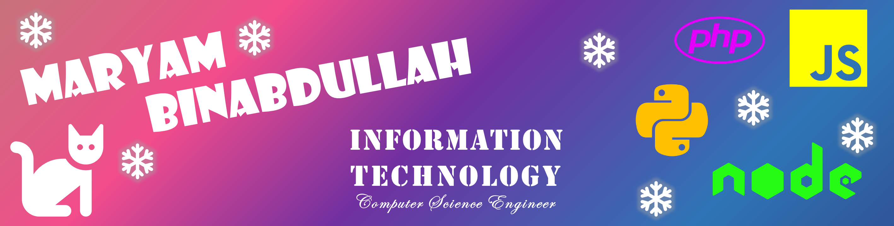

 
# Hello, folks!  
 
I'm a software developer, started with HTML and CSS making simple static web pages and expanded my knowledge over time till I've found myself diving into php and javascript and using it to create full websites along with databases. 
 

 Most recently I've been trying to get better at python by creating bots and AI models also using it as backend for websites. 
 

### **My Skills** 
                 

### **Languages and Frameworks I enjoy:** 
    

### **Languages and Frameworks I'm learning:** 
  

## **Recent GitHub Activity** 
  
---

